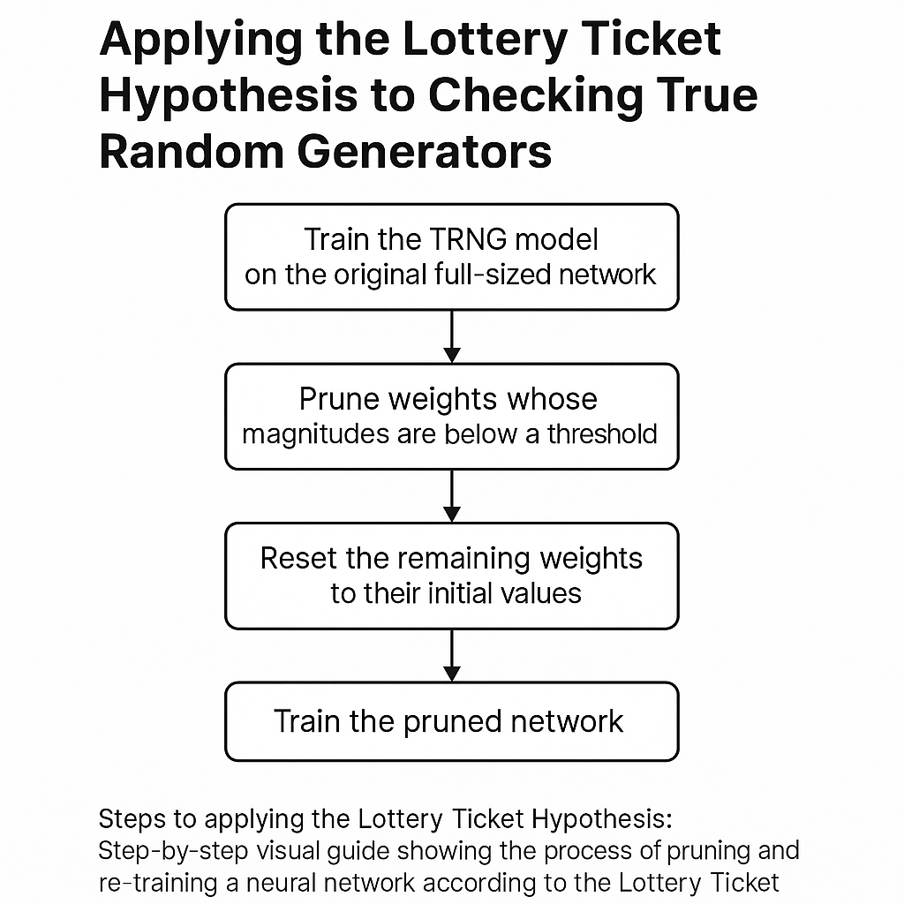

# TRNG CNN Quality Checker with Lottery Ticket Hypothesis

## 🎯 What is this project?
This project implements a 1D Convolutional Neural Network (CNN) to evaluate the quality of binary random number sequences. The goal is to test whether a neural network can detect patterns in bitstreams that are *supposed* to be truly random — for example, from a True Random Number Generator (TRNG) or a Pseudo-Random Number Generator (PRNG).

This approach is inspired by the paper:
> **"Assessing the Quality of Random Number Generators through Neural Networks"**  
> [ResearchGate link](https://www.researchgate.net/publication/381370870_Assessing_the_quality_of_random_number_generators_through_neural_networks)

Their work demonstrated that CNNs could distinguish TRNG vs PRNG sources based on bitstream structures, meaning some RNGs leave detectable artifacts.

This project simulates binary sequences (or imports real ones) and trains a CNN to classify them based on their origin.

---

## 🧠 Applying the Lottery Ticket Hypothesis (LTH)

After successfully training the model, we apply the **Lottery Ticket Hypothesis (LTH)** to compress it.

**LTH states:**
> Within a large, randomly initialized network, there exists a smaller sub-network (a "winning ticket") that — when trained in isolation — can match the performance of the original network.

### ✅ Steps applied:
1. **Train the full CNN** on binary sequences.
2. **Prune low-magnitude weights**, reducing model size.
3. **Reinitialize the remaining weights** to their original values (from before training).
4. **Retrain the pruned subnetwork**.

This process reduces memory footprint and training time while preserving performance — making it ideal for embedded systems evaluating randomness in real-time.

---

## 🚀 Future Work
- Integrate live TRNG input from ESP32 or similar hardware
- Add statistical randomness tests (e.g. entropy, chi-squared) alongside CNN prediction
- Visualize pruning masks and learned filters

---

MIT License © 2025 – For educational and experimental use
